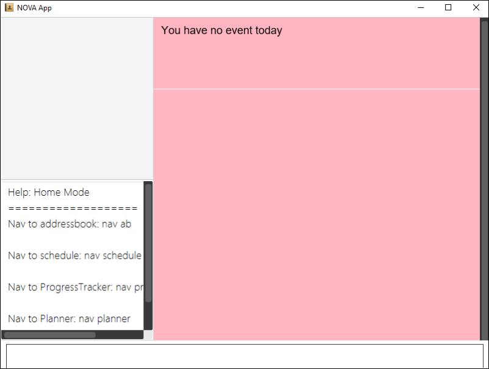

= NOVA
ifdef::env-github,env-browser[:relfileprefix: docs/]

https://travis-ci.org/AY1920S2-CS2103T-F10-3/main.svg?branch=master[image:https://travis-ci.org/AY1920S2-CS2103T-F10-3/main.svg?branch=master[Build Status]]

ifdef::env-github[]

endif::[]

ifndef::env-github[]
image::images/Ui.png[width="600"]
endif::[]

* Next-gen Organizing Virtual Assistant (NOVA) is a one-stop desktop application for CS2103T students to manage all CS2103T related activities, from studying to planning project meetings. NOVA is designed for users who prefer to use the Command Line Interface (CLI).
* Target Users are students who are currently enrolled in CS2103T or equivalent.

== Site Map

* <<UserGuide#, User Guide>>
* <<DeveloperGuide#, Developer Guide>>
* <<AboutUs#, About Us>>
* <<ContactUs#, Contact Us>>

== Acknowledgements

* AddressBook-Level3 project created by SE-EDU initiative at https://se-education.org

== Licence : link:LICENSE[MIT]

